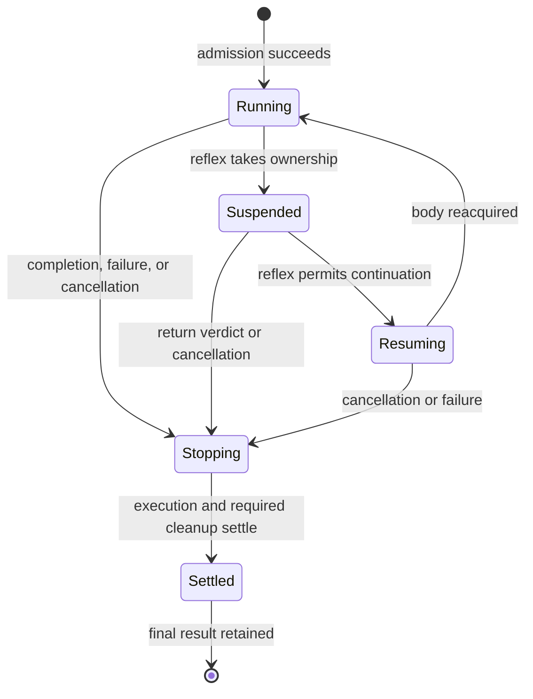

# Asynchronous foreground actions and progress reporting

Status: implemented and physically qualified in the async-actions branch. See [qualification evidence](async-actions-qualification.md).

Date: 2026-09-12.

## Purpose

Let the model decide when to reassess ongoing work without surrendering the runtime's ownership of movement and immediate survival. Foreground MCP calls submit an action and optionally wait for completion or a timeout in that same call. A separate wait tool returns when that action settles or a bounded waiting period expires. The model can inspect the bot, assess progress, wait again, or cancel the objective.

Every admitted foreground action has a retained, typed final result. Starting another foreground action requires retrieval of the preceding full result through `wait_for_action`. Shared time and movement measurements, together with action-specific evidence, make the value of continued execution visible throughout the action.

Returning to the model and releasing the bot's body are separate events.

## Original foundations

Before this change, the implementation separated several concerns:

- [Action definitions](../../src/actions/action.ts) classify information, control, ordinary tasks, and resumable tasks, and provide per-action result schemas and formatters.
- [The runner](../../src/session/action-runner.ts) admits foreground work and arbitrates physical ownership with reflexes. It retains a logical request across resumptions, but does not retain settled results.
- [Request evidence](../../src/session/request.ts) has a baseline, current checkpoint, and observed completion condition. Coverage and detail vary between actions.
- [The MCP adapter](../../src/server/mcp.ts) currently awaits execution, renders the final output, and records the response. Its request signal reaches the executor.
- [Navigation evidence](../../src/navigation/orchestration/outcome.ts) contains positions, timing, and execution counters. The inspected contracts do not expose an accumulated physical-distance counter.
- [The runtime supervisor](../../src/server/runtime-supervisor.ts) protects a separate bot process from unresponsive execution. HTTP requests are no longer a sufficient inventory of work once submissions return immediately.

These baseline observations were made during concurrent development. See the
[usage guide](async-actions.md) for the implemented protocol.

## Scope and decisions

The first version includes:

1. Async submission for all actions classified as foreground work.
2. One admitted model objective per bot, including its suspended and stopping periods.
3. A repeatable `wait_for_action` tool with completion and timeout semantics.
4. Information and control calls admitted independently of the foreground slot.
5. Retained final outputs and automatic result retrieval tracking before the next foreground submission.
6. Shared progress measurements across the entire action, with typed action-specific progress for every foreground action.
7. Safe submission retries, client reconnection, and honest runtime-failure outcomes.

The first version does not add queued objectives, concurrent model objectives, in-place goal editing, automatic retries after process failure, or new reflex continuation policies. It does not introduce a general predicate language or arbitrary JavaScript/SQL wait conditions. Optional bounded waiting on submission shares the regular wait path. Event-triggered wakeups and native MCP Tasks integration remain deferred.

Information and control calls remain direct calls. Forcing a status read through a submit-and-wait cycle would add no useful interaction opportunity.

## Invariants

- One logical foreground request remains reserved until it settles, even when a reflex owns the body or execution is waiting to resume.
- At most one physical owner writes body controls at a time. Existing takeover and cleanup ordering remains authoritative.
- A submission is accepted only after validation, admission reservation, and recording its identity. Acceptance means the runtime owns the work, not that its objective succeeded.
- Ending a submitting call or wait does not cancel admitted execution.
- Cancellation is a request to stop. It does not establish settlement or free the foreground slot before cleanup.
- A settled result is immutable and remains retrievable after retrieval.
- A settled wait records result retrieval. Pending or aborted waits, status, cancellation, and SQL reads do not release the result gate.
- Reflex protection remains available while a result awaits retrieval.
- Live progress is evidence about ongoing work. `partial` remains a terminal action outcome.
- Missing observations are reported as missing or stale, never replaced with invented completion evidence.

## Three independent lifecycles

The runtime retains these separately:

| Concern | States |
| --- | --- |
| Logical execution | `running`, `suspended`, `resuming`, `stopping`, `settled` |
| Physical ownership | Existing idle, foreground, yielding, and takeover states |
| Result retrieval | No result yet, awaiting retrieval, retrieved |

Admission is atomic; a refused submission never enters execution. Internal preparation may happen within `running` and is described by the action's phase.



Fatal runtime loss can settle any live state with a runtime-failure result. This records interrupted execution and the limits of available evidence; it does not assert that normal cleanup completed.

Result retrieval is an admission condition, not a body lock. A retrieved result does not mean the body is available: an idle reflex may still be running.

## Public tool contract

Existing `rationale` and `response_format` conventions remain. TypeScript shapes below are illustrative contracts; the registered Zod schemas define the implemented API.

### Foreground submission

Keep each action's existing name and domain arguments. Add invocation metadata:

```ts
type ForegroundInvocation = {
  submission_id: string;
  wait_timeout_ms?: number; // integer, 0 through 120000; omitted returns an accepted handle
};

type SubmissionResponse =
  | {
      state: "accepted";
      actionId: string;
      action: string;
      admittedAt: string;
    }
  | {
      state: "refused";
      code: string;
      error: string;
      activeActionId?: string;
      unretrievedActionId?: string;
    }
  | WaitResponse;
```

`submission_id` is a caller-generated retry key scoped to the bot. Repeating the same key and action arguments retrieves the original acceptance without executing again, including after completion. Reusing a key for different action arguments returns `SUBMISSION_CONFLICT`. Rationale, response representation, and initial wait timeout are invocation metadata and do not change execution identity; retain the original rationale. Resolve a duplicate before ordinary admission checks.

Without `wait_timeout_ms`, the response is an accepted handle even for fast work. With it, successful admission delegates to the same bounded wait used by `wait_for_action`: completion returns the full settled output and releases the result gate, while timeout returns pending progress. Zero polls immediately. Refusals return immediately, invalid timeouts are rejected before admission, and client cancellation after admission stops only the wait. The timer starts after admission; it does not limit execution. Each foreground tool publishes only its own result and progress schema, while the standalone wait tool publishes the union across actions.

Refusals include invalid arguments, unavailable runtime, an existing logical request or physical owner, and an unretrieved result. They create no new execution or result-retrieval obligation. Busy responses identify the logical action when one exists, and the physical owner when a reflex alone is busy. No refused request is queued or silently replaces work.

### Waiting and result retrieval

```ts
type WaitRequest = {
  action_id: string;
  timeout_ms: number; // integer, 0 through 120000; required
};

type WaitResponse =
  | {
      state: "pending";
      wakeReason: "timeout";
      actionId: string;
      progress: AnyActionProgress;
      duringWait: ProgressChange;
    }
  | {
      state: "settled";
      wakeReason: "settled";
      actionId: string;
      output: AnyActionOutput;
    };
```

The wait ends on settlement or its own timeout, whichever happens first. `timeout_ms: 0` reads immediately. A pending timeout is successful observation, not an execution failure, terminal partial result, or cancellation. Unknown IDs produce `ACTION_NOT_FOUND`; they are not treated as running actions. IDs belonging to another bot are not valid in this bot's API.

The 120-second cap is the initial server limit. Client qualification must establish a supported timeout below each client's transport/tool limit; agents use shorter waits where required. Invalid durations are rejected rather than silently clamped.

Waits register a settlement listener and timer, then recheck state so completion cannot be missed between inspection and subscription. Settlement wins if it is already recorded when the timer callback runs. Multiple callers may wait for the same action. Each wait owns and disposes only its own listener and timer.

Client cancellation stops the wait only. There is no physical preparation, body claim, or foreground admission for a wait. Repeated retrieval returns the same stored output, even after another action starts.

### Status and control

`view_status` includes the active logical action ID, its progress, current physical owner, and any result awaiting retrieval. It must distinguish an idle body with an unread result from active execution. Other information calls and read-only SQL remain available.

Extend `cancel_foreground_action` to require `action_id` and retain its reason argument. Cancellation targets the logical request rather than whichever owner happens to hold the body. A repeated cancellation is idempotent; cancellation of an old action never stops a newer one. An already-settled target is reported as settled and its result remains available through waiting.

Cancelling an objective prevents resumption and asks its executor to settle. A currently necessary survival reflex may continue to a safe release. This requires care because the existing cancellation path also aborts the current physical owner. Preserve explicit survival-policy controls; do not disguise disabling a reflex as objective cancellation.

After cancellation, retrieve the final result with a settled wait before submitting replacement work.

### Result retrieval gate

Each execution retains one `resultRetrieved` flag, initially false. A wait that returns the full terminal output records it as true. No agent-supplied acknowledgement or receipt exists. Returning partial, failed, or cancelled terminal output also releases this gate; a pending or aborted wait does not.

Before retrieval, a new foreground submission returns `RESULT_NOT_RETRIEVED`, `unretrievedActionId`, and instructions to call `wait_for_action`. While execution is active, `ACTION_BUSY` identifies `activeActionId` and gives the same wait guidance. Duplicate submission keys still return the original acceptance without executing again or releasing the result gate.

Persist retrieval state before returning the settled wait. On persistence failure, return `storage_failed` with the observed output, leave the gate closed, and retry persistence on the next wait without repeating physical work. Once retrieved, invalid or busy successor submissions do not undo retrieval. Physical ownership checks still apply independently.

This records that the server provided the full result through a wait. It does not prove comprehension or transport receipt: a response lost during disconnect can be retrieved again by the same action ID. The gate is bot-scoped across connections; any full-result wait releases it, while status and SQL observers do not. Arbitration between multiple independent controlling agents is outside this change.

## Progress contract

Each admitted action has one progress record, created once and retained through every route, attempt, reflex interruption, and resumption. Reading it must not advance cursors, reset counters, or mutate execution.

### Shared measurements

| Field | Definition |
| --- | --- |
| `sampledAt` | Timestamp of this snapshot; freshness is separate from execution state |
| `positionSampledAt`, `positionAgeMs` | Time and age of the latest position observation, independent of when a reader asks for a snapshot |
| `elapsedMs` | Time from admission through the snapshot, including planning, reflexes, and cleanup |
| `suspendedMs` | Time during which a reflex interrupts or delays continuation of the logical request, including handoff |
| `distanceTravelledBlocks` | Sum of sampled 3D movement distances across valid continuous segments during the request |
| `reflexDistanceBlocks` | Subset of that observed movement occurring under a reflex's physical ownership |
| `distanceFromStartBlocks` | 3D straight-line distance from the original action start in the same dimension; otherwise null |
| `start`, `current` | Positions together with their dimensions |
| `movementCoverage` | Whether movement observation is complete or has gaps, with known discontinuities |
| `state` | Logical execution state and suspension reason where applicable |

Use monotonic clocks for in-process duration measurements and wall-clock timestamps for external correlation. Freeze elapsed time at settlement; time spent waiting to retrieve a result is not execution duration. `durationMs` on the final action envelope agrees with the frozen `elapsedMs`.

Suspended time and reflex distance have distinct definitions. A foreground cleanup may still own the body while the logical request is suspended; those movement samples are not relabelled as reflex movement. Avoid double-counting nested reflex periods.

A runtime-owned movement observer samples actual bot positions at a consistent cadence. It measures once per bot and attributes segments to the active request and physical owner. Actions do not sum planned routes or independently install overlapping distance trackers. This captures movement across navigation runs and movement from combat, knockback, or other physical effects. The totals describe observed activity, not proven useful work or purely self-propelled travel.

Known teleport, server reposition, respawn, dimension change, and observation-gap boundaries terminate the previous movement segment. Rebase before accumulating again; never count a coordinate jump as travelled distance or bridge an unobserved interval as known travel. Retain known distance and mark incomplete coverage. Ordinary sampling gives an estimate, not an exact continuous path integral. Position jitter and correction handling need focused qualification before choosing any filtering tolerance.

Travel can accumulate valid segments in different dimensions. Distance from start is null while the current dimension differs from the starting dimension, and may be calculated again after returning to that dimension. Coordinates alone do not establish travel between dimensions.

### Action-specific measurements

Each foreground action supplies a typed progress schema and a pure snapshot reader. The action name discriminates the combined progress contract. Common measurements do not replace action-owned baselines, completion conditions, or final evidence.

Action progress describes its current phase, factual achievement, and what remains required for completion. Counts and goals are included only where meaningful. Current achievement may regress; cumulative activity generally does not.

| Action family | Evidence to expose |
| --- | --- |
| Navigation | Current destination and distance, arrival conditions, current navigation phase; remaining distance is not planned route length |
| Collection | Requested items, net inventory gain still carried, blocks broken, current phase |
| Hunting/combat objectives | Requested drops or target outcome, observed inventory/target evidence, attempts and confirmed effects separately, current phase |
| Building/placement | Required cells currently satisfied, remaining cells, confirmed placements; completed placement activity is distinct from a structure still being intact |
| Crafting/smelting/bartering | Requested output and observed output, completed batches or transactions, current processing/collection phase; smelting also exposes native cook/fuel progress and slot counts |
| Containers/equipment/drop/eat/bucket | Requested state or transfer, confirmed effects so far, pending confirmation |
| Exploration/stronghold/portal objectives | Existing action-owned discoveries and milestones, current phase, observed completion condition |
| Other foreground actions, including debug | Shared measurements and a truthful phase/completion condition; no invented numeric percentage |

Inventory progress reports what the completion contract requires. For example, broken ore is activity while net requested items still carried is current achievement. Items spent or lost can reduce that achievement. A cumulative count must not silently substitute for a current-state requirement.

Progress snapshot support must also reach ordinary one-shot actions. The present observer callback on resumable executors is insufficient for across-the-board coverage. Extend the common action contract/context with one request-scoped progress registration mechanism; preserve existing retained executors and evidence. Avoid a separate accounting implementation for live and final reporting.

No generic percentage, ETA, or universal "last meaningful progress" clock is required. Those need action-specific semantics. Existing navigation/combat futility rules remain in their owners; movement counters or phase changes must not renew those rules accidentally.

Pending MCP waits include a current survival snapshot and net health/hunger
changes during the wait, in addition to movement and action checkpoints. These
changes are endpoint comparisons, not total damage or food-consumption counters.
The ordinary shared notification formatter also applies to pending waits: retain
up to three unread previews and the full-event retrieval hint. Completed reflex
outcomes summarize interrupted work and observed effects; internal decision and
phase events remain diagnostic-only. Label unread history separately from the
wait interval and current survival separately from historical final evidence.

### Changes over an observation interval

Every pending wait includes changes from that wait's entry snapshot to its return snapshot. Name both timestamps. This baseline belongs to that waiter, so another reader cannot reset it. Immediate reads have a zero-length interval.

Derive shared additive deltas from cumulative counters. Derive action-specific changes only for fields whose meaning supports comparison; inventory changes may be negative. If the comparison crosses an incompatible goal or measurement boundary, omit the invalid delta and explain the discontinuity.

For comparisons across separate waits, callers can compare their returned cumulative snapshots. A server-managed historical cursor and arbitrary lookback windows are deferred.

An illustrative pending report is:

```text
collect_block A — running for 2m 10s; suspended for 24s
Travelled 186 blocks, including 31 during reflexes; 72 blocks from start.
Collected 11/32 iron; currently approaching an observed ore block.
During this wait (30s): +1 iron, +68 blocks travelled.
```

Status, waiting, and the final result use the same underlying progress record. Read the action evidence once per snapshot so related fields agree. Final output contains the frozen final progress alongside the existing typed outcome and interruption history.

## Result schemas and presentation

Execution results retain the existing per-action schemas. Foreground submission gets the new acceptance/refusal schema. `wait_for_action` has a stable object-root envelope whose settled branch contains the union of registered foreground outputs, discriminated by `action`. Generate that union from the action catalogue instead of manually maintaining it or exposing unchecked `any` data.

Validate final output against its original action schema before publishing settlement. Reuse the original action formatter for Markdown retrieval. JSON retrieval contains the full validated output. Both formats include the action ID, with no need to query SQL for essential evidence.

Acceptance and pending responses have `isError: false`. Submission/wait lookup errors have `isError: true`. Retrieval of a final output preserves current conventions: failed/cancelled outcomes are errors, partial/succeeded outcomes are not. A runtime that cannot supply action-owned evidence uses a runtime-failure envelope rather than fabricating a typed physical result.

Freeze result-time survival and policy snapshots with the output. Current notifications or current status can accompany retrieval, but must be labelled separately from the historical result and must not alter it. Refusal and cancellation-request replies are not substitutes for retrieving the full execution outcome.

MCP has a Tasks extension for asynchronous handles and eventual results, but host support requires negotiation. The first version uses ordinary model-visible tools so the model explicitly chooses when and how long to wait. Keep the internal execution/result store independent of that choice. Revisit native Tasks only after verifying client compatibility and that it exposes the intended interaction opportunity. Reference: [MCP Tasks overview](https://modelcontextprotocol.io/extensions/tasks/overview).

## Persistence, retries, and host failure

Separate the MCP call log from logical execution records. One execution can have a submission, several waits, status reads, and final result retrieval. All calls retain their own request/response evidence; all relevant calls link to the same stable action ID. Existing incident attribution continues to use the original admitted execution's request ID, not the newest wait's call ID.

Store the accepted execution identity, retry key, original arguments/rationale, admission time, terminal output and result retrieval state. Persist admission before any world effects. Persist terminal output and retrieval state before returning a settled wait. Never mutate historical action-call rows to make an acceptance response look like a final physical result.

An admission persistence failure refuses execution. If terminal persistence fails after physical work, retain the observed result in memory, report the storage failure explicitly, and block successor admission until the result and retrieval state can be committed. Retrying persistence must not rerun physical work. Do not emit a generic retryable submission failure after execution has happened.

Client disconnects leave execution running. Reconnection can discover the active action or unread result through status and recover a lost submission response using the same retry key. Submission deduplication prevents repeat execution within this runtime contract; it is not a guarantee of transactional world effects across a process crash.

The supervisor must track admitted background executions even when no HTTP call is pending, retaining their identities in diagnostics. A fatal runtime failure must unblock active waiters with an explicit failure. While the child is unavailable, new calls can return the existing host failure envelope with the affected action identity and incident reference; they must not wait indefinitely or invent a successful result.

On explicit restart, reconcile durable nonterminal executions as interrupted runtime failures before admitting new foreground work. Recover the last available progress with its sample age and incomplete coverage. Do not resume or resubmit world work automatically, and do not present a pre-crash checkpoint as an observed final inventory or position. Retain that failure result and retrieve it through the same contract.

Persistent storage retains results across restart. Temporary storage retains them only for its runtime lifetime; after loss, old IDs are unknown. For the initial implementation, do not automatically prune execution records, unread results, or retry keys. Future bounded retention must define expiry and deduplication together rather than silently permitting an old submission key to execute again.

## Ownership and implementation boundaries

| Owner | Responsibility |
| --- | --- |
| Action runner/session | Atomic logical admission, action lifetime, cancellation, body/reflex coordination, settlement |
| Runtime progress observer | Shared time/movement sampling and ownership attribution, request-lifetime snapshots |
| Action implementation | Typed progress and completion evidence, executor and original final result |
| Runtime execution/result store | Durable identity, retry lookup, retained final output, result retrieval gate |
| MCP adapter | Submission/wait/control tools, argument and output schemas, formatting, independent call logging |
| Host supervisor | Liveness and failure reporting for admitted executions independently of HTTP lifetime |

Use one retained execution object and one terminal promise per action. Attach terminal error handling when admitting it. Waiting subscribes to the retained execution; it never starts a replacement executor. Preserve the direct awaited library execution path for existing scenarios where useful, sharing the same underlying runner rather than introducing a second concurrency model. MCP result retrieval policy belongs at its admission boundary; physical ownership invariants apply to every caller.

The main implementation areas are the action contract, session runner/request model, runtime composition, MCP adapter, bot-data execution storage, and supervisor reporting. Most domain execution algorithms should remain unchanged. Upgrade their progress readers and tighten cancellation wiring where required.

## Migration sequence

1. **Add shared and typed progress.** Create request-lifetime measurement and snapshot support for ordinary and resumable actions. Expose the same evidence in current status and final outputs while existing awaited execution still works.
2. **Add retained executions.** Implement identity, retry handling, logical admission, terminal storage, and cancellation independent of caller signals. Qualify reflex handoff and disconnect behaviour before changing the tool contract.
3. **Expose async tools and result retrieval.** Add submission envelopes, waiting, targeted cancellation, generated schemas, and the result gate together. Update MCP instructions, call-log queries, tool documentation, agent examples, and consumers of `recentCalls`/health. A status read must not make an observer lose sight of the active objective.
4. **Qualify recovery and model use.** Exercise supervisor failure, reconnection, repeated retrieval, and a physical multi-route action with reflex interruption. Verify client timeout limits and generated schema size/acceptance in actual clients.

This is a breaking foreground MCP response change. Release it explicitly; do not claim an accepted handle matches the previous final-output schema. Avoid a permanent second synchronous execution implementation. The optional initial wait delegates to the same submission and waiting paths.

## Acceptance criteria

Use focused lifecycle/contract tests and a small number of isolated physical scenarios. Do not duplicate an entire domain test suite for the new delivery mechanism.

- An unwaited submission returns a handle while execution continues. An initial bounded wait returns pending progress or the full typed result without a second call. Status, SQL reads, waits, and control calls remain usable during it.
- Two simultaneous submissions cannot admit two logical objectives, including during reflex release/resumption gaps.
- Repeating a submission key after a lost reply returns the same action ID and produces no additional physical effects. Conflicting reuse is refused.
- Wait timeout/cancellation leaves work running; completion during wait registration cannot be missed; every exit removes waiter resources.
- Cancellation during a reflex prevents objective resumption without bypassing required safe physical release. Cancelling an old ID cannot affect its successor.
- The same full typed result can be retrieved repeatedly after completion, retrieval, and successor admission. A timeout never creates a partial terminal result.
- An unread result blocks new foreground work. A settled wait releases the result gate; pending waits, status, and cancellation do not. Invalid arguments or busy admission do not undo retrieval.
- Progress persists across multiple navigation routes and repeated reflex interruptions. Nested reflex time is counted once; movement has one observer and no route double-counting.
- A loop increases travel while ending near the start. A teleport/portal/respawn does not add a jump to travel. Observation gaps are visible.
- Collection/hunt progress reflects items still carried and can regress. Attempt counts remain distinct from confirmed effects. Ordinary actions expose progress as well as resumable actions.
- Concurrent status/wait readers do not change another waiter's comparison baseline. The final progress snapshot stops changing after settlement.
- Runtime loss with no pending submission call remains attributable. Waiters receive a failure, and restart reconciliation never automatically replays world work.
- A model playthrough demonstrates an actual reassessment after a timed wait and retrieval of the complete result before its next foreground action.

## Deferred extensions

Event-driven waiting can later add explicit alternatives such as relevant player messages, selected reflex transitions, or action-specific milestones. Such wakeups must report their reason and preserve the foreground action. Model control does not automatically return merely because an async action exists; in version one, it returns at submission, completion, or the selected wait timeout.

Other follow-ups are explicit execution budgets, longer-term progress history, result retention policy, and native MCP Tasks support. None is required to establish the first version's lifecycle and progress contract.
